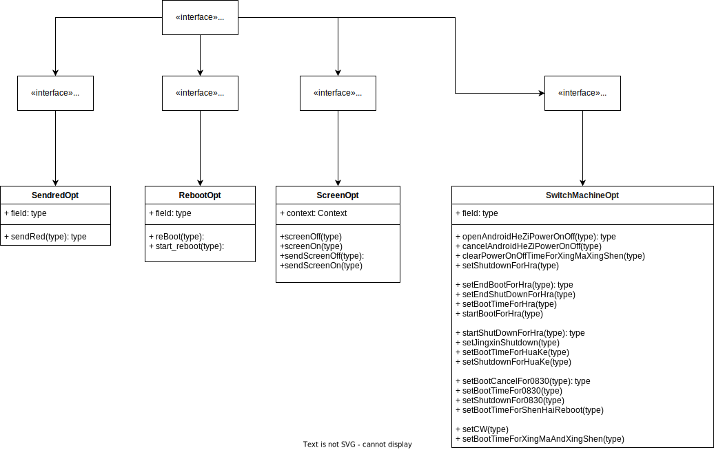

  #### deviceOptComponent技术文档

### 一. 前言:
 ####  *** 此组件是统一处理现有交付业务 屏的开关机操作，红外操作，亮屏息屏操作，定时重启的功能抽离;组件内不做业务调度处理只提供向外的接口数据;过滤运行时日志Tag为IDeviceOpt

  ### 1.  引进 implementation 'com.idc.idcsdk:deviceOptComponent:1.0.2'

  -----

## 2.  初始化调用
   DeviceOptManager.INSTANCE.toInit(this);

### UML类图:

## 3.接口说明:
 对外暴露4个公共接口
 >> IRebootOpt  //重启操作
    IScreenOpt  //息屏操作
    ISendredOpt  //红外操作
    ISwitchMachineOpt  //开关机操作

公共接口:

> 红外操作:

    DeviceOptManager.INSTANCE.getSendredOpt().sendRed()  //红外操作
> 息屏亮屏操作

    DeviceOptManager.INSTANCE.getScreenOpt().sendScreenOn()//发送亮屏
    DeviceOptManager.INSTANCE.getScreenOpt().sendScreenOff()//发送息屏
    DeviceOptManager.INSTANCE.getScreenOpt().screenOff()//息屏
    DeviceOptManager.INSTANCE.getScreenOpt().screenOn()//亮屏
> 重启操作

      DeviceOptManager.INSTANCE.getRebootOpt().reBoot(
        @DeviceType.DeviceType deviceType: String,
        timers: String,
        taskType: Int,
        isCancel: Boolean
    )

    DeviceOptManager.INSTANCE.getRebootOpt().reBoot(
        @DeviceType.DeviceType deviceType: String,
          timers: String,
          taskType: Int,
            isCancel: Boolean
        )
> 开关机操作

    DeviceOptManager.INSTANCE.getSwitchMachineOpt().openAndroidHeZiPowerOnOff(powerOffTime: String, timer: Long)

    fun handlerOpt(
     @DeviceType.DeviceType deviceType: String,
     startBoot: String,
     delay: Long,
     taskType: Int,
     isOpen: Boolean )

    fun openAndroidHeZiPowerOnOff(powerOffTime: String, timer: Long)
    fun cancelAndroidHeZiPowerOnOff()
    fun clearPowerOnOffTimeForXingMaXingShen()
    fun setShutdownForHra(startBoot: String)
    fun setEndBootForHra()
    fun setEndShutDownForHra()
    fun setBootTimeForHra(startBoot: String, delay: Long)
    fun startBootForHra()
    fun startShutDownForHra()

    fun setJingxinShutdown(timer: String, delay: Long, isOpen: Boolean)

    fun setBootTimeForHuaKe(startBoot: String, delay: Long)

    fun setShutdownForHuaKe(startBoot: String)

    fun setBootCancelFor0830()

    fun setBootTimeFor0830(startBoot: String, delay: Long)

    fun setShutdownFor0830(startBoot: String, taskType: Int, isOpen: Boolean)

    fun setBootTimeForShenHaiReboot(

       startBoot: String,
       delay: Long,
       isOpen: Boolean
    )

    fun setCW(startBoot: String, delay: Long)

    fun setBootTimeForXingMaAndXingShen(startBoot: String, delay: Long)

###   细节说明

  ####  业务可在需要的地方调用相关操作的具体方法:
   ### 下面方法比较特殊，
    内部根据设备类型帮我们调用了相关开关机的业务操作；参考，信发业务的TimerTask 类的onStart(String titles) 对于TASKTYPE_SHUTDOWN = 2; // 定时开关机业务封装;即它内部封装了这块业务，也可忽略此方法根据业务要求单独调用其它具体屏的相关操作方法

    SwitchMachineOpt中的 fun handlerOpt(
        deviceType: String,
        startBoot: String,
        delay: Long,
        taskType: Int,
        isOpen: Boolean  )
